<p align="center">
  
</p>

<h1 align="center">Deploying Your First Kubernetes Cluster</h1>

<p align="center"><b>A production-ready Kubernetes cluster with K3s — in minutes.</b> Install scripts, core manifests, and three runnable example stacks to learn from. K3s is a lightweight, certified Kubernetes in a single binary.</p>

<p align="center">
  
  
  
  <a href="LICENSE"></a>
</p>

---

## Quick start

```bash
git clone https://github.com/ry-ops/deploying-your-first-kubernetes-cluster.git
cd deploying-your-first-kubernetes-cluster

./scripts/install-k3s.sh      # install K3s (single binary, ~512MB RAM)
./scripts/setup-kubectl.sh    # point kubectl at the new cluster
kubectl apply -f manifests/   # deploy the sample app
```

```bash
kubectl get nodes      # control-plane + agents, Ready
kubectl get pods -A    # system + your pods
```

Add agents by running the installer in worker mode, and skip Traefik if you'd rather bring your own ingress — see [K3S-SETUP.md](documentation/K3S-SETUP.md).

## What you can deploy

<p align="center">
  
</p>

- **Core manifests** (`manifests/`) — `deployment`, `service`, `ingress`, `configmap` to learn the basics.
- **Monitoring** (`examples/monitoring/`) — Prometheus + Grafana.
- **Multi-tier app** (`examples/multi-tier-app/`) — frontend, backend, database.
- **WordPress** (`examples/wordpress/`) — a stateful app with MySQL and a persistent volume.

Each example has its own README and applies with `kubectl apply -f examples/<name>/`.

## Learn more

- [K3S-SETUP.md](documentation/K3S-SETUP.md) — installation options, HA, workers
- [KUBECTL-GUIDE.md](documentation/KUBECTL-GUIDE.md) — the commands you'll use daily
- [TROUBLESHOOTING.md](documentation/TROUBLESHOOTING.md) — when things don't come up

## License

MIT. See [LICENSE](LICENSE).

<!-- org-footer -->
---

<p align="center"><sub>Part of <a href="https://github.com/ry-ops">ry-ops</a> · building the pipes between infrastructure, automation, and observability · built by <a href="https://github.com/ry-ops">ry-ops</a></sub></p>
